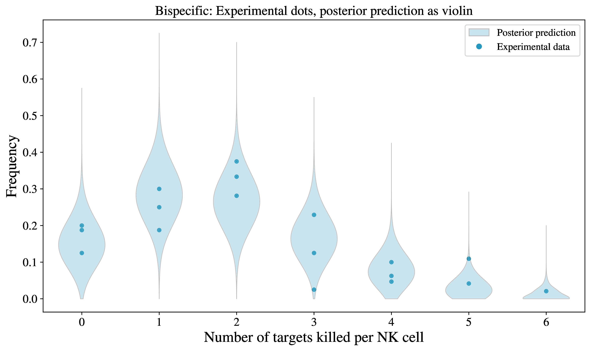

# Fish — A Simple Bayesian Inference Workflow for Quantifying NK Cell Killing Efficiency

---

**Authors**

Elephes Sung, Cathal Hosty & Rubén Pérez-Carrasco

*Department of Life Sciences, Imperial College London, London SW7 2AZ, United Kingdom*

---

## Introduction

This mini-project investigates ***NK cell–mediated cytotoxicity*** through a Bayesian inference workflow. Our goal is to quantitatively characterise NK cell killing efficiency by fitting a mathematical model to experimental data. Specifically, we model the number of tumour cells killed per NK cell under varying conditions—such as treatment with antibodies or drugs—and use the posterior distribution to infer differences in cytotoxic activity. This approach not only enables statistical comparison across conditions but also allows us to evaluate the adequacy of the proposed mathematical model by comparing posterior predictions with experimental observations. Ultimately, this modelling framework serves both as a tool for hypothesis testing and as a means to uncover potential biological mechanisms underlying NK cell function. 

The project is named *Fish* as a nod to the **Poisson distribution** used in the model—*Poisson* being French for "fish"—and metaphorically, to represent the process of "fishing out" hidden mechanisms from biological data using mathematical insight.

---

## Mathematical Model

We model NK cell–mediated cytotoxicity as a Poisson process, under the assumption that each NK cell kills tumour cells independently at a constant rate $r$ (kills per unit time). This implies that, over a fixed observation window of duration $T$, the number of target cells killed by an individual NK cell follows a Poisson distribution with mean $\lambda = r \cdot T$.

That is, for each cell, the number of kills $N$ satisfies:

$$
N \sim \mathrm{Poisson}(\lambda), \qquad
\Pr(N = k \mid \lambda) = e^{-\lambda} \frac{\lambda^k}{k!}
$$

In a single experimental replicate, suppose we observe $M$ NK cells. Let $K_k$ denote the number of cells that killed exactly $k$ targets. Then the histogram of kill counts across the population, $\mathbf{K} = (K_0, K_1, \dots)$, follows a **Multinomial distribution** with total count $M$ and category probabilities $\mathbf{p}(\lambda) = (p_0(\lambda), p_1(\lambda), \dots)$, where:

$$
p_k(\lambda) = \Pr(N = k \mid \lambda) = e^{-\lambda} \frac{\lambda^k}{k!}
$$

To make the model computationally practical, we truncate the histogram at a cutoff $K_\star$. Instead of modelling an infinite number of categories, we consider explicit bins for $k = 0, 1, \dots, K_\star - 1$, and pool all higher counts into a single **tail bin**. The probability mass of this tail is given by:

$$
p_{\ge K_\star}(\lambda) = 1 - \sum_{k = 0}^{K_\star - 1} p_k(\lambda)
$$

We then define the truncated histogram as $\tilde{\mathbf{K}} = (K_0, \dots, K_{K_\star - 1}, K_{\ge K_\star})$, with corresponding probabilities $\tilde{\mathbf{p}} = (p_0(\lambda), \dots, p_{K_\star - 1}(\lambda), p_{\ge K_\star}(\lambda))$, and model:

$$
\tilde{\mathbf{K}} \sim \mathrm{Multinomial}(M, \tilde{\mathbf{p}})
$$

> **Why a Multinomial rather than separate Binomials?**  
> The counts $K_k$ are not independent across $k$. Given the total number of observed NK cells $M$, the joint distribution of all category counts is Multinomial. Modelling them as independent Binomial distributions would overestimate the information content and violate the constraint that $\sum_k K_k = M$.

### Thesis language
Quantifying the efficiency of NK cell-mediated cytotoxic process is crucial for understanding the impact of immunotherapies and antibody-based treatments. However, NK cell killing is inherently stochastic: not all NK cells engage targets, and those that do may kill a varying number of tumour cells. To interpret such variability meaningfully, we require a probabilistic framework that reflects both biological uncertainty and experimental constraints.

We model NK cell-mediated cytotoxicity as a Poisson process, under the assumption that each NK cell kills tumour cells independently and at a constant average rate $r$ over a fixed observation window of duration $T$. This leads to the number of kills $N$ per cell being Poisson-distributed with mean $\lambda = r \cdot T$:

$$
N \sim \mathrm{Poisson}(\lambda), \qquad
\Pr(N = k \mid \lambda) = e^{-\lambda} \frac{\lambda^k}{k!}, \quad \text{where} \quad \lambda = r \cdot T
$$

From this individual-cell model, we derive a population-level likelihood based on experimental data. Suppose $M$ NK cells are observed in a given condition. The experiment yields a histogram of kill counts: $K_0$ cells with zero kills, $K_1$ with one kill, and so on. Rather than model each $K_k$ as an independent Binomial, we recognise that these counts are constrained by the total number of cells:

$$
\sum_{k} K_k = M
$$

This constraint introduces dependencies among the bin counts. Therefore, the correct statistical approach is to model the entire histogram jointly using a Multinomial distribution:

$$
(K_0, K_1, \dots, K_K) \sim \mathrm{Multinomial}\left(M, ; \mathbf{p}(\lambda)\right)
$$

where $\mathbf{p}(\lambda) = (p_0(\lambda), p_1(\lambda), \dots, p_K(\lambda))$ are the probabilities of observing 0, 1, …, $K$ kills under the Poisson model, and $K$ is a chosen truncation level beyond which probabilities are pooled into a tail bin:

$$
p_k(\lambda) = \Pr(N = k \mid \lambda) = \frac{e^{-\lambda} \lambda^k}{k!}, \quad p_{\ge K} = 1 - \sum_{k=0}^{K-1} p_k(\lambda)
$$

This structure captures both the biological randomness of NK cell killing (via the Poisson model) and the statistical constraints of the observation process (via the Multinomial likelihood). To complete the Bayesian model, we place a prior over the unknown killing rate $\lambda$ (or directly over $r$), and use Markov Chain Monte Carlo (MCMC) to infer the posterior distribution of killing rates under different experimental conditions.

This probabilistic framework allows us not only to estimate central tendencies like the mean killing rate, but also to quantify uncertainty via posterior credible intervals. Moreover, it enables rigorous comparison of killing efficiency across treatments (e.g., Rituximab vs. control), and supports model checking via posterior predictive simulation. By connecting single-cell dynamics to population-level summaries, our approach offers both mechanistic insight and robust statistical inference.

--- 
## Results & Discussion

All result plots are available in the [`./results`](./results) sub-folder.

> **Note:** For convenient viewing in Markdown, all plots have also been converted to PNG format and placed in [`./results/pngfigures`](./results/pngfigures). This folder contains image versions of every plot for direct display in the README and on GitHub.

Figures `experimental_data_plots_combine.pdf` and `experimental_data_plots_individual.pdf` show the experimental data obtained by co-author Cathal Hosty at Dan Davis lab. *The number of tumour cells killed per NK cell* under different experimental condition can be visualised as the figures.

- **No treatment**
- **Rituximab (Rtx) administration**
- **Bispecific antibody administration**

<figure>
   
  <figcaption><b>Figure 1.</b> Mean and standard deviation of the number of tumour cells killed per NK cell under three experimental conditions: No Treatment (green), Bispecific antibody (cyan), and Rituximab (blue). Left: Frequency distribution. Right: Raw counts. Shaded regions represent standard deviation across replicates.</figcaption>
</figure>

NK cells under different conditions exhibit distinct cytotoxic behaviors. To rigorously quantify these differences despite biological noise, we developed the mathematical model described above and applied Bayesian inference using Markov Chain Monte Carlo (MCMC) methods, implemented in PyMC (see Jupyter Notebook for details).

We inferred the killing rates $r$ for each experimental condition and visualized the posterior distributions in Figure 2 ([`./results/rate_posteriors_facet.pdf`](./results/rate_posteriors_facet.pdf)):
- **No Treatment:** mean = 0.204, HDI = [0.17, 0.236]
- **Bispecific antibody:** mean = 0.377, HDI = [0.334, 0.421]
- **Rituximab:** mean = 0.384, HDI = [0.335, 0.437]

> **Note:** HDI refers to the Highest Density Interval, which is the narrowest interval containing a specified proportion of the posterior probability mass. The 95% HDI reported above was calculated for each condition, representing the range within which the true killing rate lies with 95% probability according to the posterior distribution.

Statistical analysis reveals a significant increase in NK cell killing rates following antibody administration compared to no treatment. However, there is no significant difference between the Bispecific and Rituximab groups. These findings are consistent with flow cytometry data (not shown).

<figure>
  
  <figcaption><b>Figure 2.</b> Overlaid posterior histograms of NK cell killing rates for three experimental conditions: No Treatment (green), Bispecific antibody (cyan), and Rituximab (blue). The distributions were inferred using Bayesian MCMC methods, with shaded regions indicating the 95% highest density intervals (HDI).</figcaption>
</figure>

To validate our mathematical model, we performed a posterior predictive check. We sampled all posterior rates from the distribution shown in Figure 2 (not just those within the HDI) and used these as inputs to the mathematical model, together with the observed cell numbers from each experimental replicate. By running the model 5,000 times, we generated posterior predictions for the distribution of tumour cells killed per NK cell and compared these predictions to the experimental data.

Most experimental data points fall within the central region of the violin plots representing the posterior predictions, indicating that the mathematical model captures the main features of the experimental system. However, some data points appear in the tails of the predicted distributions, suggesting that further refinement of the model may be necessary to fully account for all observed variability.

<figure>
  
  
  
  <figcaption><b>Figure 3.</b> Posterior predictive distributions (violin plots) and experimental data (dots) for the number of tumour cells killed per NK cell under three conditions: No Treatment (top), Rituximab (middle), and Bispecific antibody (bottom).</figcaption>
</figure>

--- 
## Conclusion

We developed a mathematical model of NK cell–mediated cytotoxicity under the hypothesis that each NK cell’s killing decision is independent of its previous actions. By introducing the killing rate as a key parameter and applying Bayesian inference, we quantitatively estimated cytotoxic activity across experimental conditions. Our results show a significant increase in NK cell killing rates following antibody administration compared to no treatment, with no significant difference between the Bispecific and Rituximab groups.

Posterior predictive checks indicate that the model captures the main features of the experimental data, although some discrepancies remain, particularly in the tails of the predicted distributions. This suggests that while the current model provides a robust framework for quantifying NK cell cytotoxicity, additional factors—such as dependencies on prior cell decisions—may need to be incorporated. Future work will focus on refining the model to account for such influences and further improve its explanatory power.

--- 
## Navigation of the files

- [`fish.ipynb`](./fish.ipynb): Preliminary notebook for generating synthetic data and performing MCMC-based parameter inference.
- [`KillCountProcessing.ipynb`](./KillCountProcessing.ipynb): Main analysis notebook detailing experimental data import, visualization, MCMC parameter estimation, and model validation.
- [`KillFrequency28.8.25.txt`](./KillFrequency28.8.25.txt): Raw experimental data file.
- [`aha.sh`](./aha.sh): Shell script for converting PDF plots to PNG format (for convenience; can be ignored).
- [`cluster.py`](./cluster.py): Python script used for accelerating posterior predictive validation on a remote cluster (for advanced users; can be ignored).
- [`./results`](./results): Check the results here.
